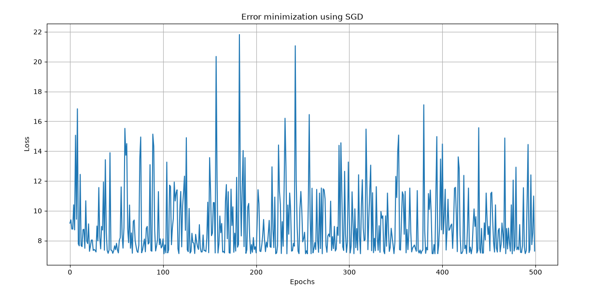

# Mini-Batch Gradient Descent from Scratch

A simple implementation of Linear Regression using Mini-Batch Gradient Descent with NumPy.

---

##Training Loss

  

The graph above shows the Mean Squared Error (MSE) throughout the training process. As the number of epochs increases, the MSE gradually decreases, indicating that the model is learning and improving its predictions. The loss eventually stabilizes, suggesting that the algorithm has converged to an optimal solution.

---

##Hyperparameters

| Parameter | Value |
|-----------|------:|
| Learning Rate | 0.005 |
| Epochs | 1000 |
| Batch Size | 5 |

---

## 🛠️ Built With

- Python
- NumPy
- Matplotlib

#Stochastic Gradient Descent from Scratch

A simple implementation of Linear Regression using **Stochastic Gradient Descent (SGD)** built entirely with **NumPy**. The model learns the relationship between screen time and battery usage by updating its parameters after processing **one training sample at a time**.

---

##Training Loss

  

The graph illustrates the Mean Squared Error (MSE) across training epochs. Because Stochastic Gradient Descent updates the model after each individual sample, the loss may fluctuate more compared to Batch Gradient Descent. Despite these fluctuations, the overall trend decreases, indicating that the model is successfully learning the underlying relationship in the data.

---

##Hyperparameters

| Parameter | Value |
|-----------|------:|
| Learning Rate | 0.01 |
| Epochs | 500 |
| Optimizer | Stochastic Gradient Descent |

---

## 🛠️ Technologies Used

- Python
- NumPy
- Matplotlib

