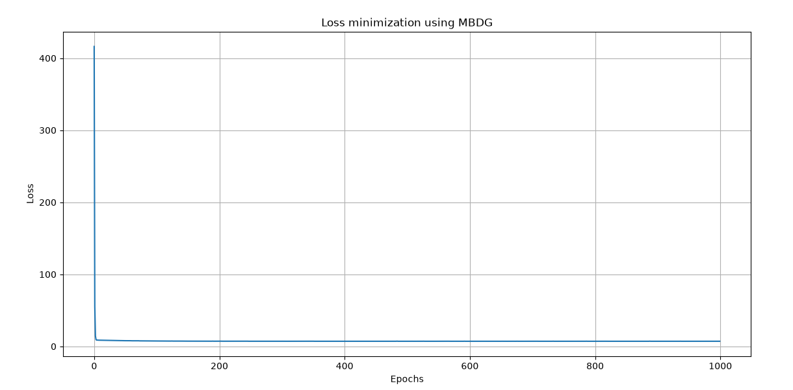

# Mini-Batch Gradient Descent from Scratch

A simple implementation of Linear Regression using Mini-Batch Gradient Descent with NumPy.

---

## 📉 Training Loss

<p align="center">
  
</p>

The graph above shows the Mean Squared Error (MSE) throughout the training process. As the number of epochs increases, the MSE gradually decreases, indicating that the model is learning and improving its predictions. The loss eventually stabilizes, suggesting that the algorithm has converged to an optimal solution.

---

## ⚙️ Hyperparameters

| Parameter | Value |
|-----------|------:|
| Learning Rate | 0.005 |
| Epochs | 1000 |
| Batch Size | 5 |

---

## 🛠️ Built With

- Python
- NumPy
- Matplotlib
```
